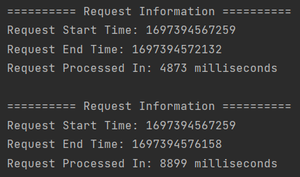

# 카카오페이 손해보험 사전과제
사전과제 1 결제시스템

결제요청을 받아 카드사와 통신하는 인터페이스를 제공하는 결제시스템
- 임베디드 데이터베이스 H2 사용
- 카드결제, 결제취소, 결제정보 조회 REST API 구현
- 단위 테스트로 각 기능 검증
- 선택 문제 부분취소 API 구현 후 테스트 케이스 확인

## 개발 환경
- IntelliJ
- Java 17 + Spring Boot 3.1.4
- H2 2.1.214

## 개발 일정
|Date|Todo|
|----|----|
|10/13(금)|요구사항 파악, 프로젝트 생성, 기본 개발환경 구축 |
|10/14(토)|테이블 설계, 필수 및 선택 API 구현, 테스트 코드 작성 |
|10/15(일)|멀티 스레드 구현 및 테스트 |
|10/16(월)|전체 테스트 후 제출 |

<details>
<summary>투두리스트</summary>

- [x] 요구사항 파악
- [x] 프로젝트 생성
- [x] 기본 개발환경 구축
  - [x] h2 데이터베이스 연동
  - [x] swagger 연동
- [x] 테이블 설계
- [x] API 구현
  - [x] 카드 결제 API
  - [x] 결제 취소 API
  - [x] 결제 정보조회 API
  - [x] 부분 취소 API
- [x] API 테스트 코드 작성
  - [x] 카드 결제 API
  - [x] 결제 취소 API
  - [x] 결제 정보조회 API
  - [x] 부분 취소 API
- [x] 멀티 스레드 구현
  - [x] 멀티 스레드 테스트 코드 작성
- [x] 전체 테스트 후 제출
  - [x] 요구사항 검토
  - [x] 전체 테스트
  - [x] 제출
</details>

## 테이블 설계
테이블명 : PAYMENT

| |COLUMN NAME|INFORMATION|
|-|-----------|-----------|
|관리번호|ID|UNIQUE ID, 20자리|
|원거래 관리번호|PAYMENT_ID|취소시에만 저장|
|결제/취소 구분|TYPE|PAYMENT/CANCEL|
|할부개월수|INSTALLMENT_MONTHS|0-12, 0은 일시불|
|결제금액|PAYMENT_PRICE|100원 이상 10억원 이하 숫자|
|취소금액|CANCEL_PRICE|100원 이상 10억원 이하 숫자|
|부가가치세|VAT|결제금액/11, 소수점 이하 반올림|
|암호데이터|DATA|카드번호, 유효기간, CVC 암호화 데이터|
|카드사데이터|STRING_DATA|공통헤더 부문 + 데이터 부문|

## 문제 해결

### 데이터 암호화 및 복호화
Jasypt 라이브러리 + PBEWithMD5AndDES 암호화 알고리즘
1. Jasypt 의존성 추가
2. `@EnableEncryptableProperties` 어노테이션 사용하여 암호화 속성 활성화
3. `JasyptStringEncryptor` 빈 사용하여 데이터 암호화 및 복호화 코드 작성
4. EncryptionConfig, EncryptionService 파일 참고

### 멀티 스레드 환경 대비
제약 조건
- 결제: 하나의 카드번호로 동시에 결제를 할 수 없습니다.
- 전체취소: 결제 한 건에 대한 전체취소를 동시에 할 수 없습니다.
- 부분취소: 결제 한 건에 대한 부분취소를 동시에 할 수 없습니다.

문제 파악
- 하나의 카드번호로 동시에 결제하는 테스트 코드 작성
  - `CountDownLatch`와 `ExecutorService`를 사용하여 결제건이 병렬로 처리되도록 구현
  - 같은 카드번호를 가지고 동시에 결제를 시도하면 두 결제 모두 성공 처리

<p align="center">
  </img>
</p>

해결 방법
- 같은 카드번호일 때만 문제가 됨으로 카드번호에 락을 부여하는 방법 선택
- 또한 전체취소/부분취소일 경우 관리번호에 락을 부여하도록 구현

## 빌드 및 실행 방법
### 프로젝트 빌드 및 실행
Java와 Git은 미리 설치되어있다는 가정 하에 진행하며 윈도우 환경 기준으로 빌드/실행하는 방법을 설명합니다.

1. 깃허브에서 프로젝트를 받아온다.
```
git clone https://github.com/kakao-insurance-quiz/20231013-sjw.git
```

2. 프로젝트를 빌드하고 실행한다.
```
# 프로젝트 빌드
cd 20231013-sjw
gradlew build

# 프로젝트 실행
cd build/libs
java -jar payment-0.0.1-SNAPSHOT.jar
```

### Swagger를 이용한 테스트
1. [Swagger](http://localhost:8080/swagger-ui/index.html)에 접속한다.
2. 아래 예시 JSON 데이터를 이용해 API들을 테스트한다.

카드결제 POST /common/payment/pay
- 부가가치세 (vat) 값은 옵션이며 입력하지 않을 경우 자동 계산
- 자동계산 수식: 결제금액 / 11, 소수점 이하 반올림
```
{
  "cardNumber": "1234567890123456",
  "expirationDate": "1125",
  "cvc": "777",
  "installmentMonths": "12",
  "paymentPrice": 110000,
  "vat": "10000"
}
```

결제조회 POST /common/payment/retrieve
```
{
    "id": "OWRjZTZlZjctZTdkZC00"
}
```

결제취소 DELETE /common/payment/cancel
- 부가가치세 (vat) 값은 옵션이며 입력하지 않을 경우 결제 데이터의 부가가치세 금액으로 취소 진행
```
{
  "id": "OWRjZTZlZjctZTdkZC00",
  "cancelPrice": 110000,
  "vat": "10000"
}
```

결제 부분취소 DELETE /common/payment/cancel/partial
- 부가가치세 (vat) 값은 옵션이며 입력하지 않을 경우 자동 계산
- 자동계산 수식: 결제금액 / 11, 소수점 이하 반올림
```
{
  "id": "OWRjZTZlZjctZTdkZC00",
  "cancelPrice": 11000,
  "vat": "1000"
}
```

### 테스트 코드를 이용한 테스트
1. `src/test`에 작성된 테스트 코드를 실행한다.
- PaymentRepositoryTest : 데이터베이스 조작 및 조회(CRUD) 테스트
- PaymentServiceTest : 비즈니스 로직에 대한 신뢰성 테스트
- PaymentApplicationTest : API 정상작동 테스트
- PaymentMultiThreadTest : Thread-Safe 테스트
- PaymentTestCase1 : 부분취소 Test Case 1
- PaymentTestCase2 : 부분취소 Test Case 2
- PaymentTestCase3 : 부분취소 Test Case 3

## 에러 상태 코드
- AlreadyUsedException (226)
  - 같은 카드번호로 다른 결제가 이미 진행중일 때
  - 같은 관리번호로 전체 취소/부분 취소가 이미 진행중일 때
- ResourceNotFoundException (404)
  - 이미 취소했는데 취소를 또 시도할 때
  - 없는 데이터를 조회하려 할 때
- InvalidParameterException (405)
  - 필수값이 입력되지 않았을 때
- NotSupportException (406)
  - 금액이나 부가가치세가 올바르지 않을 때
  - 남아있는 결제 금액이 없는데 부분 취소를 요청할 때
  - 요청한 부분 취소 결제 금액이 남아있는 결제 금액보다 클 때
  - 요청한 취소 부가가치세가 남아있는 부가가치세보다 클 때
  - 남은 요금은 다 취소됐지만 부가가치세가 남아있을 때