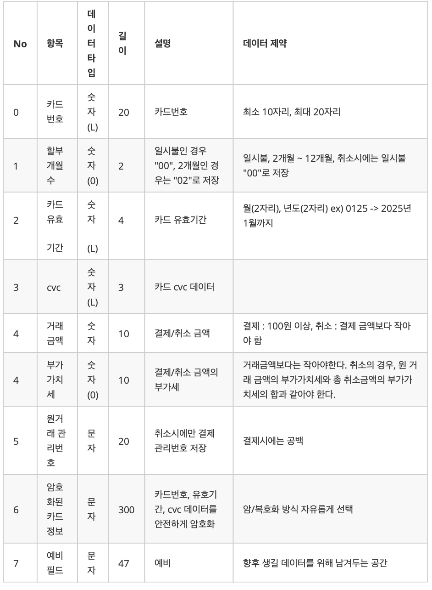
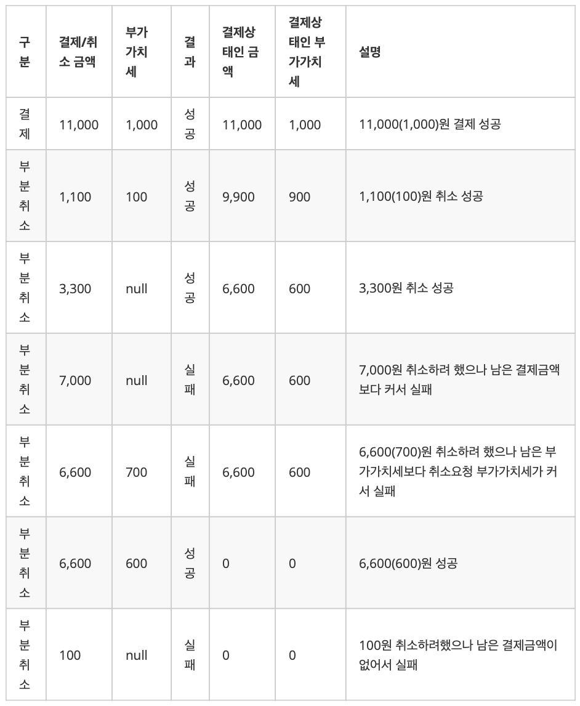
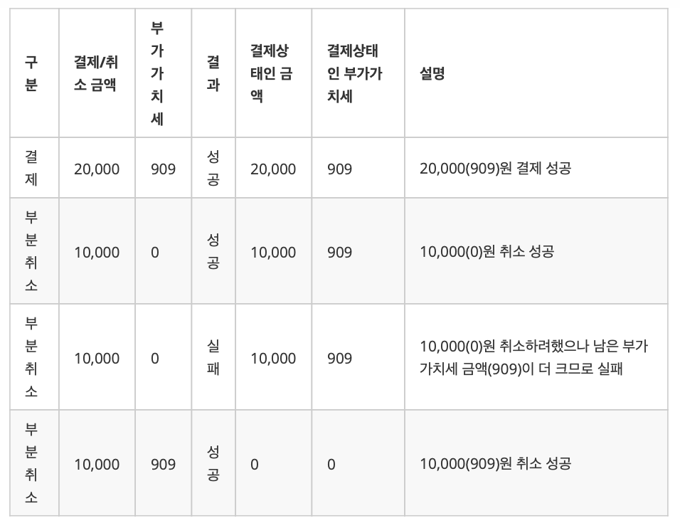
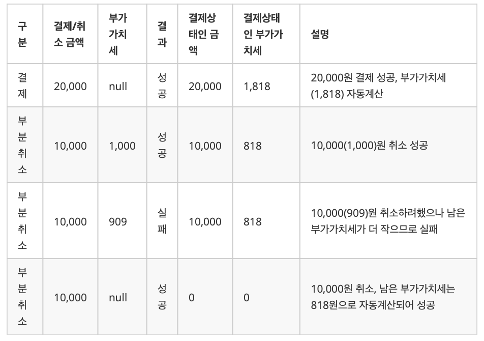
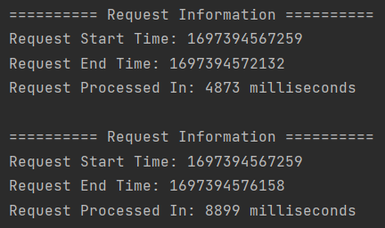

# 결제 시스템
결제, 결제취소 요청을 받아 string 데이터로 카드사와 통신하는 결제 시스템 개발

## 간단 정리
- 임베디드 데이터베이스 H2 사용
- 서비스에 필요한 테이블은 자유롭게 설계하되 string 데이터는 반드시 저장
- 각 API를 개발하고 단위 테스트로 각 기능 검증
- readme.md 파일을 추가하여 개발 프레임워크, 테이블 설계, 문제해결 전략, 빌드 및 실행 방법을 기술

## 시스템 정책
### 1. 저장하는 string 데이터
- 카드사로 전송하는 string 데이터는 공통 헤더부문과 데이터부문을 합쳐 하나의 string(450자리)으로 만들어 저장
- [string 데이터 명세](#string-data) 참고

### 2. 부가가치세
- optional 데이터이므로 값을 받지 않은 경우 자동계산
  - 자동 계산 수식 : 결제 금액 / 11
  - 소수점 이하 반올림
  - 예) 결제 금액이 1,000원일 경우 자동 계산된 부가가치세는 91원
- 부가가치세는 결제 금액보다 클 수 없음
  - 예) 결제 금액이 1,000원일 때 부가가치세는 0원일 수 있음

### 3. 카드정보 암/복호화
- 암/복호화 대상 데이터는 카드 번호, 유효기간, CVC
- 카드 정보는 모두 숫자로 이루어져 있으므로 하나의 string으로 합쳐서 암호화하고 데이터들 사이에 적당한 구분자를 추가
  - 예) encrypt(카드정보|유효기간|CVC)
- 암호화된 데이터를 복호화했을 때 카드 정보의 각 데이터를 사용할 수 있도록 객체화
- 암/복호화 방식은 자유롭게 선택

### 4. 트랜잭션 데이터 관리
- 결제, 결제취소 데이터는 각 관리번호(unique id, 20자리)로 관리
- 취소 데이터는 결제 데이터와 연결
- 관리번호로 저장되어 있는 데이터는 조회 가능
- 관리번호로 데이터 조회 시 결제 혹은 결제취소 데이터 1건만 조회

## 필수 개발 사항
### 1. 결제 API
- 카드 정보와 금액 정보를 입력 받아 카드사와 협의된 string 데이터로 저장
- request
  - required
    - 카드번호(10~16자리 숫자)
    - 유효기간(4자리 숫자, mmyy)
    - cvc(3자리 숫자)
    - 할부개월수 : 0-12, 0은 일시불
    - 결제금액(100원 이상 10억원 이하 숫자)
  - optional
    - 부가가치세
- response
  - 성공
    - 관리번호(unique id, 20자리)
    - 카드사에 전달한 string 데이터 : 공통 헤더부문 + 데이터부문

### 2. 결제취소 API
- 결제에 대한 전체 취소는 1번만 가능
- 부가가치세 정보를 넘기지 않는 겨우, 결제 데이터의 부가가치세 금액으로 취소
- 할부 개월수 데이터는 00(일시불)로 저장
- request
  - required
    - 관리번호(unique id, 20자리)
    - 취소금액
  - optional
    - 부가가치세
- response
  - 성공
    - 관리번호(unique id, 20자리)
    - 카드사에 전달한 string 데이터 : 공통 헤더부문 + 데이터부문

### 3. 데이터 조회 API
- 저장된 데이터를 조회해서 응답값으로 반환
- request
  - 관리번호(unique id, 20자리)
- response
  - 성공
    - required
      - 관리번호(unique id, 20자리)
      - 카드 정보 : 암호화된 데이터를 복호화해서 데이터 생성
        - 카드번호 : 앞 6자리와 뒤 3자리를 제외한 나머지 마스킹 처리
        - 유효기간
        - cvc
      - 결제/취소 구분
      - 금액 정보
        - 결제/취소 금액
        - 부가가치세
    - optional
      - 추가로 내려주면 좋을 데이터 자유롭게 추가

### 4. API 요청 실패 시
- 자유롭게 정의한 에러 코드, 에러 응답 반환

### 5. 멀티 스레드 환경에 대비
- 제약조건을 만족시키기 위한 방어코드를 추가하고 테스트 코드 방어가 되었음을 증명
- 제약 조건
  - 결제 : 하나의 카드번호로 동시에 결제를 할 수 없다.
  - 전체취소 : 결제 한 건에 대해 전체취소를 동시에 할 수 없다.
  - 부분취소 : 결제 한 건에 대해 부분취소를 동시에 할 수 없다.

#string-data
## string 데이터 명세
- 데이터 타입 : 설명에서 언더바(_)는 빈 칸을 표현한 것
  - 숫자 : 우측으로 정렬, 빈 자리 공백, ex) 4자리 숫자 : 3 → ___3
  - 숫자(0) : 우측으로 정렬, 빈 자리 0, ex) 4자리 숫자(0) : 3 → 0003
  - 숫자(L) : 좌측으로 정렬, 빈 자리 공백, ex) 4자리 숫자(L) : 3 → 3___
  - 문자 : 좌측으로 정렬, 빈 자리 공백, ex) 10자리 문자 : HOMEWORK → HOMEWORK__
- 공통 헤더 부문
  - 데이터 길이 : 숫자, 길이 4, "데이터 길이"를 제외한 총 길이
  - 데이터 구분 : 문자, 길이 10, 승인(PAYMENT) or 취소(CANCEL)
  - 관리번호 : 문자, 길이 20, unique id
- 데이터 부문

  </img>

## string 데이터 예제
- 결제요청 데이터
  - 카드 정보
    - 카드번호 : 1234567890123456
    - 유효기간 : 1125
    - cvc : 777
  - 할부 개월수 : 0(일시불)
  - 결제 금액 : 110000
  - 부가가치세 : 10000
- string 데이터
  - 이해를 돕기 위해 빈 칸은 언더바(_)로 대체
  - 암호화된 카드데이터(100자리) : YYYYYYYYYYYYYYYYYYYYYYYYYYYYYYYYYYYYYYYYYYYYYYYYYYYYYYYYYYYYYYYYYYYYYYYYYYYYYYYYYYYYYYYYYYYYYYYYYYYY
  - 결제 관리번호 : XXXXXXXXXXXXXXXXXXXX
  - 전체취소 관리번호 : ZZZZZZZZZZZZZZZZZZZZ
- 결제 string 데이터
  - _446PAYMENT___XXXXXXXXXXXXXXXXXXXX1234567890123456____001125777____1100000000010000____________________YYYYYYYYYYYYYYYYYYYYYYYYYYYYYYYYYYYYYYYYYYYYYYYYYYYYYYYYYYYYYYYYYYYYYYYYYYYYYYYYYYYYYYYYYYYYYYYYYYYY_______________________________________________________________________________________________________________________________________________________________________________________________________________________________________________________
- 전체취소 string 데이터
  - _446CANCEL____ZZZZZZZZZZZZZZZZZZZZ1234567890123456____001125777____1100000000010000XXXXXXXXXXXXXXXXXXXXYYYYYYYYYYYYYYYYYYYYYYYYYYYYYYYYYYYYYYYYYYYYYYYYYYYYYYYYYYYYYYYYYYYYYYYYYYYYYYYYYYYYYYYYYYYYYYYYYYYY_______________________________________________________________________________________________________________________________________________________________________________________________________________________________________________________

## 선택 개발 사항
### 부분 취소 API
- 정책
  - 결제한 건에 대해 모두 취소가 될 때까지 부분 금액으로 계속해서 취소 가능
  - 부가가치세 검증 로직 : 결제 금액의 부가가치세 = 모든 부분취소 부가가치세의 합
    - ex) 10,000원 결제 시 1,000원씩 10번 취소 가능
  - 결제취소 API에 해당 기능을 추가해도 되고 따로 API를 추가해도 됨
    - 단 api interface는 결제취소 API와 동일하도록

## Test Case
### Test Case 1
</img>

### Test Case 2
</img>

### Test Case 3
</img>

---

## 개발 환경
- IntelliJ
- Java 17 + Spring Boot 3.1.4
- H2 2.1.214

## 개발 일정
| NO | TODO |
| - | - |
| 01 | 요구사항 파악, 프로젝트 생성, 기본 개발환경 구축 |
| 02 | 테이블 설계, 필수 및 선택 API 구현, 테스트 코드 작성 |
| 03 | 멀티 스레드 구현 및 테스트 |
| 04 | 전체 테스트 후 제출 |

## 테이블 설계
테이블명 : PAYMENT

| | COLUMN NAME | INFORMATION |
| - | - | - |
| 관리번호 | ID | UNIQUE ID, 20자리 |
| 원거래 관리번호 | PAYMENT_ID | 취소시에만 저장 |
| 결제/취소 구분 | TYPE | PAYMENT/CANCEL |
| 할부개월수 | INSTALLMENT_MONTHS | 0-12, 0은 일시불 |
| 결제금액 | PAYMENT_PRICE | 100원 이상 10억원 이하 숫자 |
| 취소금액 | CANCEL_PRICE | 100원 이상 10억원 이하 숫자 |
| 부가가치세 | VAT | 결제금액/11, 소수점 이하 반올림 |
| 암호데이터 | DATA | 카드번호, 유효기간, CVC 암호화 데이터 |
| 카드사데이터 | STRING_DATA | 공통헤더 부문 + 데이터 부문 |

## 데이터 암호화 및 복호화
Jasypt 라이브러리 + PBEWithMD5AndDES 암호화 알고리즘

1. Jasypt 의존성 추가
2. `@EnableEncryptableProperties` 어노테이션 사용하여 암호화 속성 활성화
3. `JasyptStringEncryptor` 빈 사용하여 데이터 암호화 및 복호화 코드 작성
4. EncryptionConfig, EncryptionService 파일 참고

## 멀티 스레드 환경 대비
### 1. 제약 조건
- 결제 : 하나의 카드번호로 동시에 결제를 할 수 없다.
- 전체취소 : 결제 한 건에 대한 전체취소를 동시에 할 수 없다.
- 부분취소 : 결제 한 건에 대한 부분취소를 동시에 할 수 없다.

### 2. 문제 파악
- 하나의 카드번호로 동시에 결제하는 테스트 코드 작성
  - `CountDownLatch`와 `ExecutorService`를 사용하여 결제건이 병렬로 처리되도록 구현
  - 같은 카드번호를 가지고 동시에 결제를 시도하면 두 결제 모두 성공 처리

    </img>

### 3. 해결 방법
- 같은 카드번호일 때만 문제가 됨으로 카드번호에 락을 부여하는 방법 선택
- 또한 전체취소/부분취소일 경우 관리번호에 락을 부여하도록 구현

## 빌드 및 실행 방법
Java와 Git은 미리 설치되어있다는 가정 하에 진행하며 윈도우 환경 기준으로 빌드/실행하는 방법 설명

1. 깃허브에서 프로젝트를 받아온다.
```
git clone https://github.com/kakao-insurance-quiz/20231013-sjw.git
```

2. 프로젝트를 빌드하고 실행한다.
```
# 프로젝트 빌드
cd 20231013-sjw
gradlew build

# 프로젝트 실행
cd build/libs
java -jar payment-0.0.1-SNAPSHOT.jar
```

## Swagger를 이용한 테스트
1. [Swagger](http://localhost:8080/swagger-ui/index.html)에 접속한다.
2. 아래 예시 JSON 데이터를 활용하여 테스트한다.

카드결제 POST /common/payment/pay
```
{
  "cardNumber": "1234567890123456",
  "expirationDate": "1125",
  "cvc": "777",
  "installmentMonths": "12",
  "paymentPrice": 110000,
  "vat": "10000"
}
```

결제조회 POST /common/payment/retrieve
```
{
    "id": "OWRjZTZlZjctZTdkZC00"
}
```

결제취소 DELETE /common/payment/cancel
```
{
  "id": "OWRjZTZlZjctZTdkZC00",
  "cancelPrice": 110000,
  "vat": "10000"
}
```

결제 부분취소 DELETE /common/payment/cancel/partial
```
{
  "id": "OWRjZTZlZjctZTdkZC00",
  "cancelPrice": 11000,
  "vat": "1000"
}
```

## 에러 상태 코드
- AlreadyUsedException (226)
  - 같은 카드번호로 다른 결제가 이미 진행중일 때
  - 같은 관리번호로 전체 취소/부분 취소가 이미 진행중일 때
- ResourceNotFoundException (404)
  - 이미 취소했는데 취소를 또 시도할 때
  - 없는 데이터를 조회하려 할 때
- InvalidParameterException (405)
  - 필수값이 입력되지 않았을 때
- NotSupportException (406)
  - 금액이나 부가가치세가 올바르지 않을 때
  - 남아있는 결제 금액이 없는데 부분 취소를 요청할 때
  - 요청한 부분 취소 결제 금액이 남아있는 결제 금액보다 클 때
  - 요청한 취소 부가가치세가 남아있는 부가가치세보다 클 때
  - 남은 요금은 다 취소됐지만 부가가치세가 남아있을 때